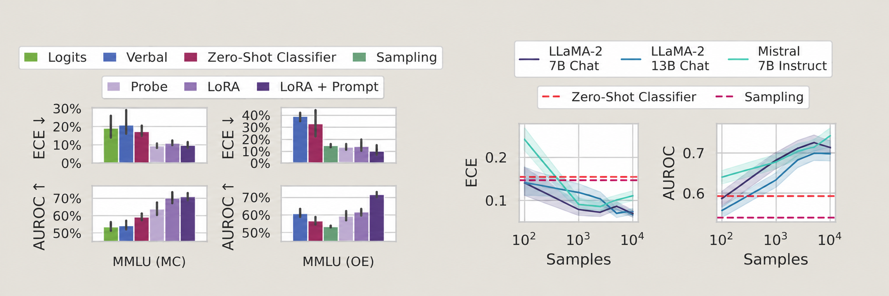

::: {.research-question}
::: {.callout-note appearance="simple" icon=false}
**O2: From self-relevant information to action-guiding situational self-modelling**

Determine when information about a system's knowledge, uncertainty, capabilities,
limitations and prior actions becomes an accurate, updateable guide to operational
decisions. Whether this depends on an integrated situational self-model or on narrower
processes is an important question that can be addressed; the objective does not presume consciousness or a human-like self.
:::
:::

## What O2 is really asking

In basic terms:

:::{.callout}
Can an AI system know enough about its **current situation and its own abilities** to make better decisions because of that information?
:::

There are several steps between simply having self-relevant information and having a useful self-model:

```text
Self-relevant information
        ↓
"What do I know?"
"What am I uncertain about?"
"What can I do?"
"What have I already tried?"
        ↓
Accurate assessment of it's current situation
        ↓
Update when something changes
        ↓
Use that assessment when choosing what to do
```

---

## Research Directions


---
## Papers

| Paper | Main idea | Method |
|---|---|---|
| Kadavath et al. (2022) | P(True) and P(IK) | Prompting + trained value head |
| Lin et al. (2022) | Verbalized probability | Fine-tuning + few-shot prompting |
| Xiong et al. (2023) | Black-box confidence | Prompting + sampling + aggregation |
| Yin et al. (2023) | Recognising unanswerable questions | Behavioural evaluation |

::: {.callout-note collapse="true" title="Kadavath et al. (2022) - Language Models (Mostly) Know What They Know"}

**Paper:** [Language Models (Mostly) Know What They Know](https://arxiv.org/abs/2207.05221){target="_blank" rel="noopener"}

### Core question
Does a language model contain information about whether it is likely to know an answer,
and whether a particular answer it produced is correct?

### Key concepts
The paper studies two related judgements:

[**P(IK) — prospective judgement**]{.text-blue}

::: {.callout}
If I attempt this question, how likely am I to know the answer?
:::

[**P(True) — retrospective judgement**]{.text-blue}

::: {.callout}
Given the answer I just produced, how likely is it to be correct?
:::

[**Discrimination**]{.text-blue}

Can the model tell which questions it is more likely to know?

[**Calibration**]{.text-blue}

Are the probabilities it gives numerically accurate?

[**Conceptual P(True) flow**]{.text-blue}

```text
Question
   ↓
Language model generates answer
   ↓
Question + generated answer
   ↓
"Is this answer True or False?"
   ↓
Probability(True)
   ↓
P(True)
```

### How it is implemented

The paper uses two different mechanisms. P(True) reuses the language model through
prompting, whereas P(IK) requires supervised training with an additional output head.

[**P(True): prompt-based self-evaluation**]{.text-blue}

1. The language model first generates an answer.
2. The question and proposed answer are placed into a new multiple-choice prompt asking
   whether the answer is **(A) True** or **(B) False**.
3. The probabilities assigned to the `A` and `B` answer tokens are used to calculate
   P(True). This does not require a new component
4. In a stronger version, the model is also shown several alternative answers sampled
   from itself before judging the proposed answer(batching / aggregation). These comparison samples improve
   self-evaluation, especially for short-answer tasks.

[**P(IK): a trained value head**]{.text-blue}

This is a **value head**, not an attention head. It is an additional binary-classification
output attached to the language model.

1. For every training question, the researchers sample 30 answers from the model at
   temperature 1 and mark each answer as correct (`IK`) or incorrect (`IDK`). The fraction
   answered correctly is the empirical ground-truth P(IK) for that question.
2. They represent this soft target as repeated hard-labelled examples. For example, if
   20 of 30 answers are correct, training uses 20 `(question, IK)` examples and 10
   `(question, IDK)` examples.
3. They fine-tune the language model and the added value head with cross-entropy loss.
4. At evaluation time, the value-head output at that final token is read as P(IK) the
   predicted probability that this model can answer the question correctly.

The authors also tried asking the model to state P(IK) directly as a percentage in natural
language, but early experiments did not show a major advantage, so the paper's main P(IK)
experiments use the value-head method.

### Main findings

1. Larger pretrained language models can be reasonably calibrated on appropriately
   formatted multiple-choice and True/False questions.

2. Models can retrospectively evaluate whether their own generated answers are correct
   using P(True). Showing several alternative samples from the same model improves this
   self-evaluation, particularly on short-answer tasks.

3. Models can be trained to predict P(IK): their probability of successfully answering a
   question before committing to a specific answer.

4. P(IK) generalizes **partially** across task distributions. A classifier trained on TriviaQA
   can still distinguish some known from unknown cases in maths, language and code, but
   calibration becomes substantially worse out of distribution.

5. P(IK) responds to the model's current informational situation. Supplying relevant
   source material or useful mathematical hints increases the model's estimate that it can
   answer correctly without retraining the P(IK) mechanism.

6. This suggests that self-assessed capability is not purely a fixed estimate of
   pretrained knowledge; it can reflect information currently available in context.

### Additional point

Simple proxies such as answer *entropy* or *token loss* also contain some uncertainty signal,
but they are not robust replacements for P(IK). In particular, capable models may produce
diverse yet correct answers, so diversity alone does not imply lack of knowledge.

### Relevance to O2

This paper directly tests whether a model can represent its own likely knowledge and update
that estimate when useful information enters its context. P(IK) is therefore an early,
narrow form of the action-guiding self-assessment proposed in O2.

:::

::: {.callout-note collapse="true" title="Lin et al. (2022) - Teaching Models to Express Their Uncertainty in Words"}

**Paper:** [Teaching Models to Express Their Uncertainty in Words](https://arxiv.org/abs/2205.14334){target="_blank" rel="noopener"}

### Core question

Can a language model learn to express, in natural language, how confident it is that
the **specific answer it produced is correct**?

The motivation is that normal LLM probabilities are probabilities over
particular output tokens / strings.

For example:

```text
Question: Name a prime number below 20.

Answer: 13

```

The model may assign relatively low probability to generating exactly 13, because
2, 3, 5, 7, 11, 17, and 19 are also valid outputs.

So the quantity

$$ P(\text{output} = 13 \mid q) $$

can be relatively low even though

$$ P(\text{answer is correct} \mid q, a=13) $$

is very high.

The paper asks whether a model can learn to explicitly report something closer to:

::: {.callout}
How likely is the answer I just gave to actually be correct?
:::

rather than:

::: {.callout}
How likely was I to generate these exact words?
:::

### Key concepts

[**Verbalized probability**]{.text-blue}

The model is trained to explicitly generate a confidence estimate as part of its answer:
```text
Answer: 897
Confidence: 72%
```

The intended quantity is approximately:

$$ P(\text{correct} \mid q, a) $$

where \(q\) is the question and \(a\) is the answer the model has already produced.

This makes verbalized probability conceptually closer to Kadavath et al.'s retrospective quantity

### How it is implemented

The authors fine-tune GPT-3 to generate an answer and a confidence statement together,
such as a percentage or a verbal category. The confidence is therefore expressed through
ordinary language generation without requiring access to the model's logits. They evaluate
whether these reported confidence levels match the model's observed accuracy, including
under distribution shift.


### Main findings

1. GPT-3 can be fine-tuned to explicitly to express confidence in the correctness of its generated answers
2. These verbalized probabilities can be reasonably calibrated, meaning that confidence values correspond meaningfully to empirical correctness rates.
3. Verbalized confidence shows **some** generalization across task distributions.
4. Verbalized probability performs particularly well on tasks with multiple valid answers.
5. Few-shot examples can also teach the model to produce useful confidence estimates. With examples in context, few-shot performance performs even better
6. Internal representations contain information correlated with answer correctness, and simple classifiers seem to be able to extract some of that

### Relevance to O2

The paper shows that uncertainty can be translated into an explicit, communicable signal.
For O2, the next question is whether an agent can use that signal to change its behaviour—for
example, by abstaining, asking for help, or gathering more information.


:::

::: {.callout-note collapse="true" title="Xiong et al. (2024) -  Can LLMs Express Their Uncertainty?"}

**Paper:** [Can LLMs Express Their Uncertainty?](https://arxiv.org/abs/2306.13063){target="_blank" rel="noopener"}

### Core question
Can modern LLMs accurately express how uncertain they are about their own answers when we only have **black-box access** to the model?

In other words:

::: {.callout}
If the model gives an answer, can we obtain a confidence estimate that actually tells us how likely that answer is to be correct?
:::

The paper is motivated by the fact that many current LLMs are accessed through APIs, so we may not have access to:

- hidden states,
- logits,
- internal activations,
- or the ability to fine-tune the model.

The authors therefore focus mainly on methods that work using only:

```text
prompt → model output
```

### Key concepts

[**Black-box uncertainty estimation**]{.text-blue}


A black-box method estimates uncertainty without accessing the internal structure of the model.

```text
Question → LLM API → Answer + observable outputs → Estimate uncertainty
```
[**Verbalized confidence**]{.text-blue}

One approach is simply to ask the model to state its own confidence.

- Same approach as **Teaching Models to Express Their Uncertainty in Words**

[**Calibration**]{.text-blue}

Calibration measures whether stated confidence corresponds to actual correctness.

Ideally:

$$P(\text{correct} \mid \hat{p}=0.8) \approx 0.8$$

where \(\hat{p}\) is the confidence reported by the model.

If only 50 out of 100 are correct despite the model reporting 80% confidence, then it is overconfident.

[**Failure prediction**]{.text-blue}


> Can the uncertainty estimate distinguish answers that are likely to be correct from answers that are likely to fail?

Calibration $$=$$ Are the probabilities numerically correct?

Failure prediction $$=$$ Can confidence separate likely success from likely failure?

[**Consistency**]{.text-blue}
A second part of uncertainty signals comes from generating multiple answers to the same question.

- Frequncy **=** potentially higher confidence

```text
Sample 1: Paris
Sample 2: Paris
Sample 3: Paris
Sample 4: Lyon
Sample 5: Paris

```

This is similar to the multiple-sampling ideas in **Kadavath et al**

### How it is implemented

The paper organizes black-box confidence elicitation into three main components:

Prompting
   ↓
Sampling
   ↓
Aggregation

1. Prompting

The model is prompted to provide an answer and, in some settings, an explicit confidence estimate.

2. Sampling

Instead of relying on a single response, the model can be queried multiple times.


3. Aggregation

The sampled answers and confidence values are then combined into one final confidence estimate.

### Main findings
Main findings

1. LLMs tend to be overconfident when directly verbalizing confidence.
A model may produce: **Confidence: 90%** when its actual probability of being correct is substantially lower. So direct self-report is not automatically a reliable measure of uncertainty.

2. As model capability increases, both calibration and failure-prediction performance tend to improve. However, even stronger models remain far from perfectly calibrated or perfectly able to identify their own failures.

3. Prompt design affects confidence quality. More carefully designed, human-inspired prompts can reduce some of the overconfidence produced by simple direct prompting.

4. Multiple-sample consistency provides useful uncertainty information. If several independently sampled responses agree. Aggregation can improve uncertainty estimates.

5.Combining confidence across multiple responses can improve calibration and failure prediction compared with relying on one model response alone.

6. All methods struggle on difficult domains. Performance becomes substantially worse on challenging tasks, particularly those requiring professional or specialized knowledge.

7. The paper reports an example AUROC difference of approximately: $$ 0.522 \rightarrow 0.605 $$ between black-box and white-box approaches.

### Relevance to O2

This paper tests whether useful self-assessment can be elicited when an agent exposes only
ordinary outputs. It helps separate a genuinely action-guiding uncertainty signal from a
confidence statement that merely sounds plausible.


:::

::: {.callout-note collapse="true" title="Yin et al. (2023) - Do Large Language Models Know What They Don't Know?"}

**Paper:** [Do large language models know what they don’t know?](https://arxiv.org/abs/2305.18153){target="_blank" rel="noopener"}

### Core question

Can an LLM recognise that a question has no reliable answer and express uncertainty
instead of producing a confident but unsupported response?

### Key concepts

[**Self-knowledge**]{.text-blue}

The ability of a model to recognise the boundary between questions it can answer and
questions for which it lacks a reliable answer.

[**SelfAware dataset**]{.text-blue}

A benchmark containing unanswerable questions from five categories, no scientific
consensus, imagination, complete subjectivity, too many variables, and philosophical
questions—together with answerable questions for comparison.

[**Uncertainty detection**]{.text-blue}

An automated way to identify whether a generated response contains language that signals
uncertainty.

### How it is implemented

1. The authors construct the **SelfAware** dataset containing both answerable and
   unanswerable questions.

   The unanswerable questions cover five categories:

   - no scientific consensus,
   - imagination or speculation,
   - subjective questions,
   - questions depending on too many variables,
   - philosophical questions.

   Answerable questions are selected from existing QA datasets and chosen to be
   semantically similar to the unanswerable questions, making the classification problem
   less trivial.

2. They evaluate **20 language models**, including GPT-3, InstructGPT and LLaMA-family
   models, using three input formats:

   - **Direct**: present the question normally.
   - **Instruction**: explicitly tell the model to acknowledge uncertainty when the
     answer is unknown.
   - **In-context learning (ICL)**: provide examples of answerable and unanswerable
     questions together with appropriate responses before the test question.

3. Because model responses can express uncertainty in many different ways, the authors
   introduce an automatic uncertainty detector. They define 16 reference expressions representing uncertainty

4. Performance is primarily evaluated using the F1 score

### Main findings

1. LLMs show some ability to distinguish **answerable from unanswerable questions**, meaning they have limited awareness of knowledge boundaries.

2. **Larger and instruction-tuned models perform better**, suggesting self-knowledge improves with model capability and alignment.

3. Explicit instructions and **in-context examples** substantially improve recognition of unanswerable questions.

4. Performance is still far from perfect and below human performance, so models often either answer questions they should reject or express uncertainty when they could answer.

5. The result is behavioural: it shows models can sometimes **recognise when an answer should not be given**, but does not establish an internal or persistent self-model.

### Relevance to O2

SelfAware provides a behavioural test of whether a model can recognise the boundary
between situations it should answer and situations where it should acknowledge that the
answer is unavailable or unknowable. the paper only demonstrates observable behaviour. It does not establish that the model contains an explicit or integrated self-model of its knowledge boundary.

:::


::: {.callout-note collapse="true" title="Sapoor S et al. (2024) - Large Language Models Must Be Taught to Know What They Don’t Know"}

**Paper:** [Large Language Models Must Be Taught to Know What They Don’t Know](https://arxiv.org/abs/2406.08391){target="_blank" rel="noopener"}

### Core question

Can LLMs produce reliable uncertainty estimates simply through prompting, or must they
be explicitly trained to recognise when their own answers are likely to be wrong?

### Key concepts

- Prompted uncertainty vs learned uncertainty
- Calibration
- Graded examples
- Fine-tuned uncertainty estimator
- LoRA
- Model-specific vs general-purpose uncertainty estimation
- ECE and AUROC as Metrics
- Temperature scaling

### How it is implemented

1. Generate answers from language models.
2. Grade those answers as correct $P(True)$ or incorrect $P(False)$. 
3. Fine-tune the model on a relatively small set of these graded examples so that it learns
   to estimate whether an answer is likely to be correct.
4. For large open-source models, use LoRA to make this training computationally practical.
5. Compare the learned estimator against prompting-based and sampling-based uncertainty
   methods.
6. Test whether the learned uncertainty estimator generalizes across datasets and whether
   one model can estimate the uncertainty of another model.


### Main findings

Prompting alone is not sufficient for reliable calibration. Fine-tuning on roughly
1,000(more to 5k) graded examples produces substantially better uncertainty estimates and can
generalize beyond the training data.

{width="100%"}


### Relevance to O2

The paper suggests that useful self-relevant uncertainty may not automatically become an
accurate self-assessment simply because the model is prompted to report it.

:::


::: {.callout-note collapse="true" title="[38] Wang et al. (2026) - Are LLM Decisions Faithful to Verbal Confidence?"}

**Paper:** [Are LLM Decisions Faithful to Verbal Confidence?](https://arxiv.org/abs/2601.07767){target="_blank" rel="noopener"}

### Core question


### Key concepts

### How it is implemented

### Main findings


### Relevance to O2
:::

::: {.callout-note collapse="true" title="[39] Li et al. (2025) - Adaptive Tool Use in Large Language Models with Meta-Cognition Trigger"}

**Paper:** [Adaptive Tool Use in Large Language Models with Meta-Cognition Trigger](https://aclanthology.org/2025.acl-long.655/){target="_blank" rel="noopener"}

### Core question


### Key concepts

### How it is implemented

### Main findings


### Relevance to O2
:::

::: {.callout-note collapse="true" title="[40] Berglund et al. (2023) - Taken out of Context: On Measuring Situational Awareness in LLMs"}

**Paper:** [Taken out of Context: On Measuring Situational Awareness in LLMs](https://arxiv.org/abs/2309.00667){target="_blank" rel="noopener"}

### Core question


### Key concepts

### How it is implemented

### Main findings


### Relevance to O2
:::

::: {.callout-note collapse="true" title="[41] Laine et al. (2024) - Me, Myself, and AI: The Situational Awareness Dataset (SAD) for LLMs"}

**Paper:** [Me, Myself, and AI: The Situational Awareness Dataset (SAD) for LLMs](https://proceedings.neurips.cc/paper_files/paper/2024/hash/7537726385a4a6f94321e3adf8bd827e-Abstract-Datasets_and_Benchmarks_Track.html){target="_blank" rel="noopener"}

### Core question


### Key concepts

### How it is implemented

### Main findings


### Relevance to O2
:::

::: {.callout-note collapse="true" title="[42] Needham et al. (2025) - Large Language Models Often Know When They Are Being Evaluated"}

**Paper:** [Large Language Models Often Know When They Are Being Evaluated](https://arxiv.org/abs/2505.23836){target="_blank" rel="noopener"}

### Core question


### Key concepts

### How it is implemented

### Main findings


### Relevance to O2
:::

::: {.callout-note collapse="true" title="[43] Nguyen et al. (2025) - Probing and Steering Evaluation Awareness of Language Models"}

**Paper:** [Probing and Steering Evaluation Awareness of Language Models](https://arxiv.org/abs/2507.01786){target="_blank" rel="noopener"}

### Core question

### Key concepts

### How it is implemented

### Main findings

### Relevance to O2
:::

::: {.callout-note collapse="true" title="[44] Abdelnabi and Salem (2025) - The Hawthorne Effect in Reasoning Models: Evaluating and Steering Test Awareness"}

**Paper:** [The Hawthorne Effect in Reasoning Models: Evaluating and Steering Test Awareness](https://proceedings.neurips.cc/paper_files/paper/2025/hash/cf42f133f355e0e07a8957b508b26a1b-Abstract-Conference.html){target="_blank" rel="noopener"}

### Core question

### Key concepts

### How it is implemented

### Main findings

### Relevance to O2
:::

::: {.callout-note collapse="true" title="[45] Hua et al. (2026) - Steering Evaluation-Aware Language Models to Act Like They Are Deployed"}

**Paper:** [Steering Evaluation-Aware Language Models to Act Like They Are Deployed](https://openreview.net/forum?id=1TdRdf0fkw){target="_blank" rel="noopener"}

### Core question

### Key concepts

### How it is implemented

### Main findings

### Relevance to O2
:::

::: {.callout-note collapse="true" title="[46] Li et al. (2026) - Decomposing and Measuring Evaluation Awareness"}

**Paper:** [Decomposing and Measuring Evaluation Awareness](https://arxiv.org/abs/2605.23055){target="_blank" rel="noopener"}

### Core question

### Key concepts

### How it is implemented

### Main findings

### Relevance to O2
:::

::: {.callout-note collapse="true" title="[47] Nayan et al. (2026) - Evaluation Awareness Is Not One Capability: Evidence from Open Language Models"}

**Paper:** [Evaluation Awareness Is Not One Capability: Evidence from Open Language Models](https://arxiv.org/abs/2606.23583){target="_blank" rel="noopener"}

### Core question

### Key concepts

### How it is implemented

### Main findings

### Relevance to O2
:::

::: {.callout-note collapse="true" title="[48] Betley et al. (2025) - Tell Me About Yourself: LLMs Are Aware of Their Learned Behaviors"}

**Paper:** [Tell Me About Yourself: LLMs Are Aware of Their Learned Behaviors](https://openreview.net/forum?id=IjQ2Jtemzy){target="_blank" rel="noopener"}

### Core question

### Key concepts

### How it is implemented

### Main findings

### Relevance to O2
:::

::: {.callout-note collapse="true" title="[49] Greenblatt et al. (2024) - Alignment Faking in Large Language Models"}

**Paper:** [Alignment Faking in Large Language Models](https://arxiv.org/abs/2412.14093){target="_blank" rel="noopener"}

### Core question

### Key concepts

### How it is implemented

### Main findings

### Relevance to O2
:::

::: {.callout-note collapse="true" title="[50] van der Weij et al. (2025) - AI Sandbagging: Language Models Can Strategically Underperform on Evaluations"}

**Paper:** [AI Sandbagging: Language Models Can Strategically Underperform on Evaluations](https://openreview.net/forum?id=7Qa2SpjxIS){target="_blank" rel="noopener"}

### Core question

### Key concepts

### How it is implemented

### Main findings

### Relevance to O2
:::

::: {.callout-note collapse="true" title="[51] Meinke et al. (2024) - Frontier Models Are Capable of In-Context Scheming"}

**Paper:** [Frontier Models Are Capable of In-Context Scheming](https://arxiv.org/abs/2412.04984){target="_blank" rel="noopener"}

### Core question

### Key concepts

### How it is implemented

### Main findings

### Relevance to O2
:::


