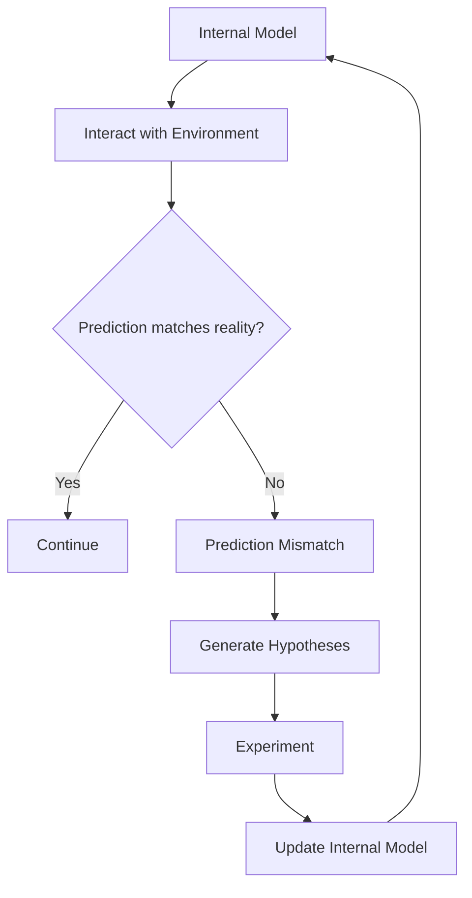
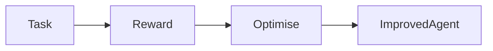
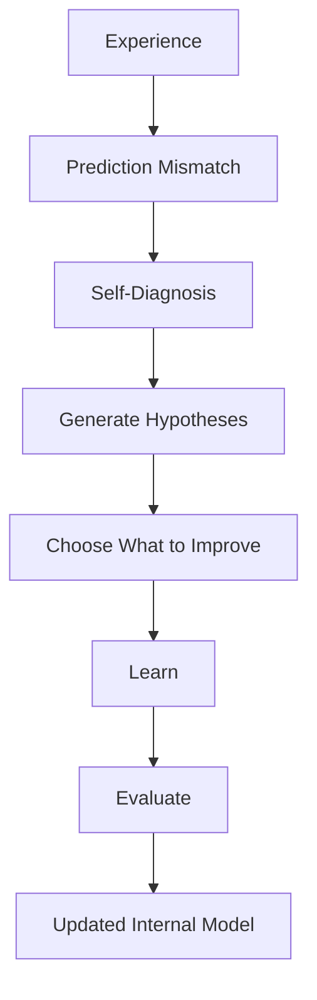
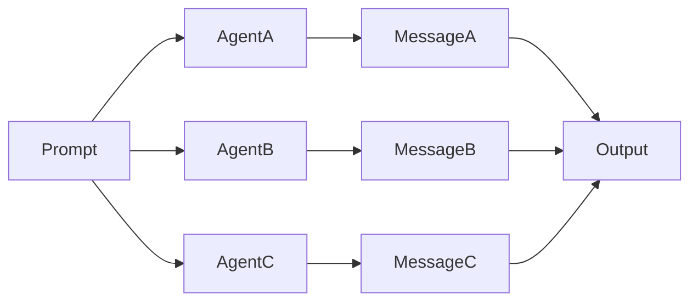
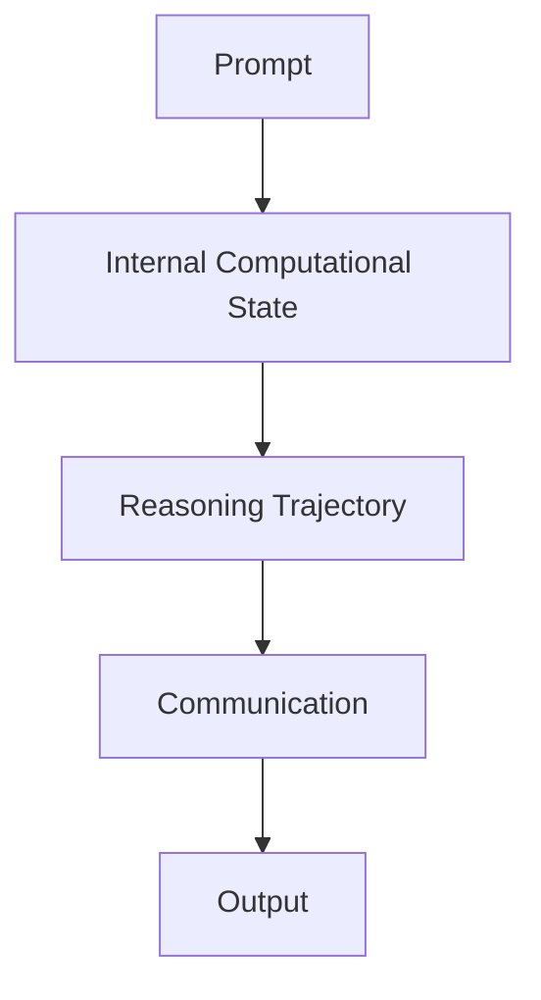
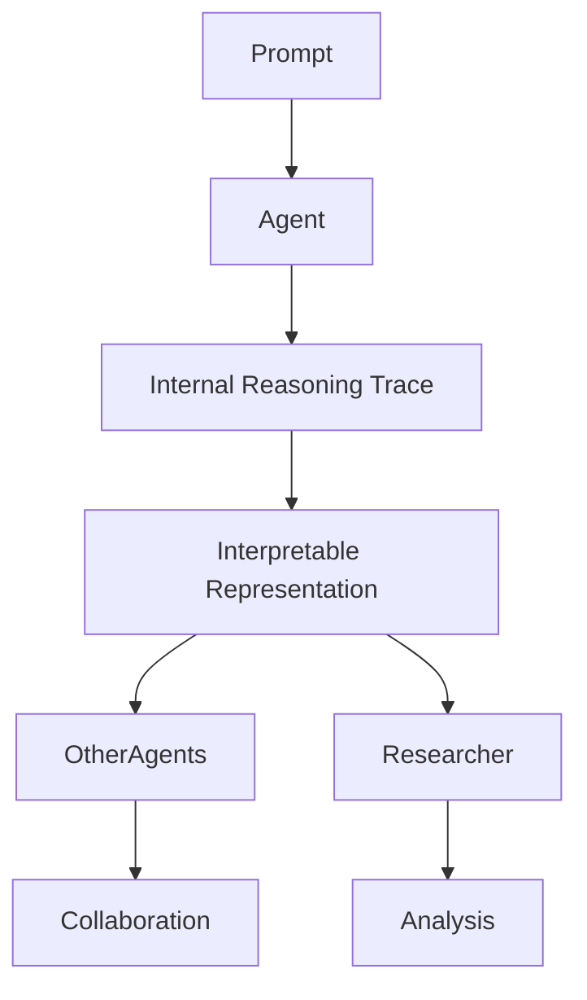

# Q1: How does an agent know it should learn? 
### Intuition
Humans often recognise that their internal understanding is incomplete *before* anyone tells them they were wrong. Rather than immediately changing their behaviour, they first recognise a mismatch between their expectations and reality.
## The Cup Analogy
Imagine someone hands you a cup with a completely unfamiliar shape. Your first instinct is to hold it like every other cup you've used, but it feels awkward. Nothing catastrophic happens you simply notice that something is "off". Your prediction about how the object should behave no longer matches your sensory experience. Rather than waiting for someone to tell you the correct answer, you naturally begin exploring different ways of holding it until a new understanding emerges.

## Scientific Interpretation 
This process resembles ideas from: 
- Predictive Processing 
- Active Inference 
- Curiosity-driven Learning 
- Intrinsic Motivation 
- World Models 

Rather than relying solely on an external reward signal, learning appears to begin with an internally generated **prediction error**. The system recognises that its current world model cannot adequately explain what it is experiencing, triggering exploration before any explicit optimisation occurs. 

Current recursive self-improvement (RSI) research typically focuses on **how a system modifies itself after a failure has been identified**. A more fundamental question may be:

> **How does the system autonomously recognise that there is something worth learning in the first place?**

Learning is primarily driven by an externally defined objective.
___
## Possible Missing Step 

> Instead of immediately optimising after receiving a reward, the agent first attempts to understand **why** its current model failed and **what** should actually be improved.

## Open Questions 
- How can an agent recognise its own knowledge gaps without relying solely on external rewards?
- What internal computational signals indicate that learning should occur? 
- Can agents distinguish between temporary failures and genuine deficiencies in their world model?
- How should an autonomous system prioritise *what* deserves improvement? 
- Can an agent generate hypotheses about its own failures before beginning optimisation?

___

# Q2: Why do identical agents think differently?

## Intuition
Imagine four scientists are given exactly the same research paper. They have similar education, the same paper, and the same objective. Yet each notices something different. 
- One immediately questions the assumptions. 
- Another focuses on methodology.
- Another thinks about practical applications.
- Another searches for weaknesses.
- 
Although they eventually communicate their conclusions, much of the reasoning that produced those ideas remains hidden.

- The interesting part is **not** that they produced different answers.
- The interesting part is **why** they produced different answers.
---
## Scientific Interpretation
Current multi-agent systems largely expose:
- prompts
- messages
- tool usage
- final outputs
However, the internal computational process that produced those decisions remains almost entirely hidden.

Even two identical agents receiving identical information may diverge because of subtle differences such as:

- stochastic decoding (temperature)
- attention dynamics
- retrieved memories
- latent representations
- intermediate reasoning trajectories
- Cumulative errors

Most current work evaluates **what agents communicate**, rather than **how they internally arrived at those communications**.

---
### Current Multi-Agent Systems

#### Hidden Process:

The majority of the reasoning process remains hidden.
#### Possible Missing Layer

Instead of only exchanging language, agents may expose interpretable summaries of *how* they reached their conclusions.

This could allow both agents and researchers to understand:
- why different reasoning paths emerged,
- why disagreement occurred,
- which reasoning strategies consistently succeed,
- and how collaboration evolves over time.
### Open Questions

- Why do identical agents diverge despite receiving identical information?
- Can internal reasoning trajectories be represented in an interpretable way?
- Which internal computations are most important for collaboration?
- Can agents communicate more than natural language?
- Would exposing internal reasoning improve coordination, consensus, or self-reflection?
- How can we distinguish meaningful reasoning differences from randomness?

---

