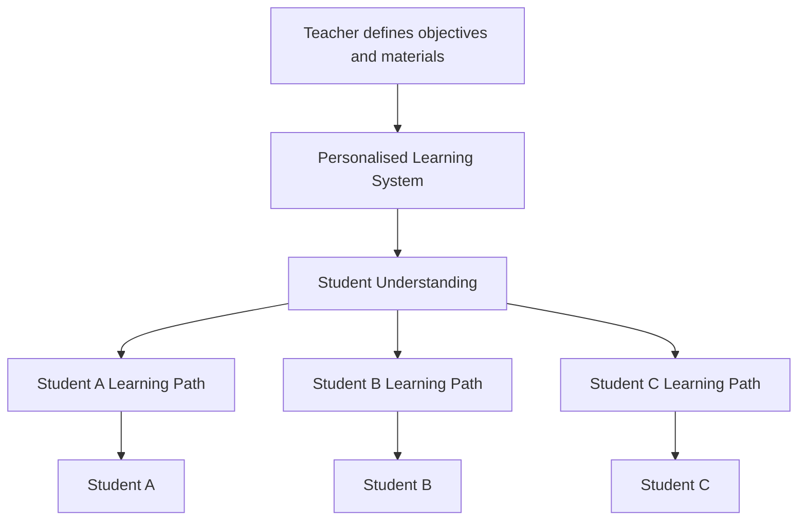
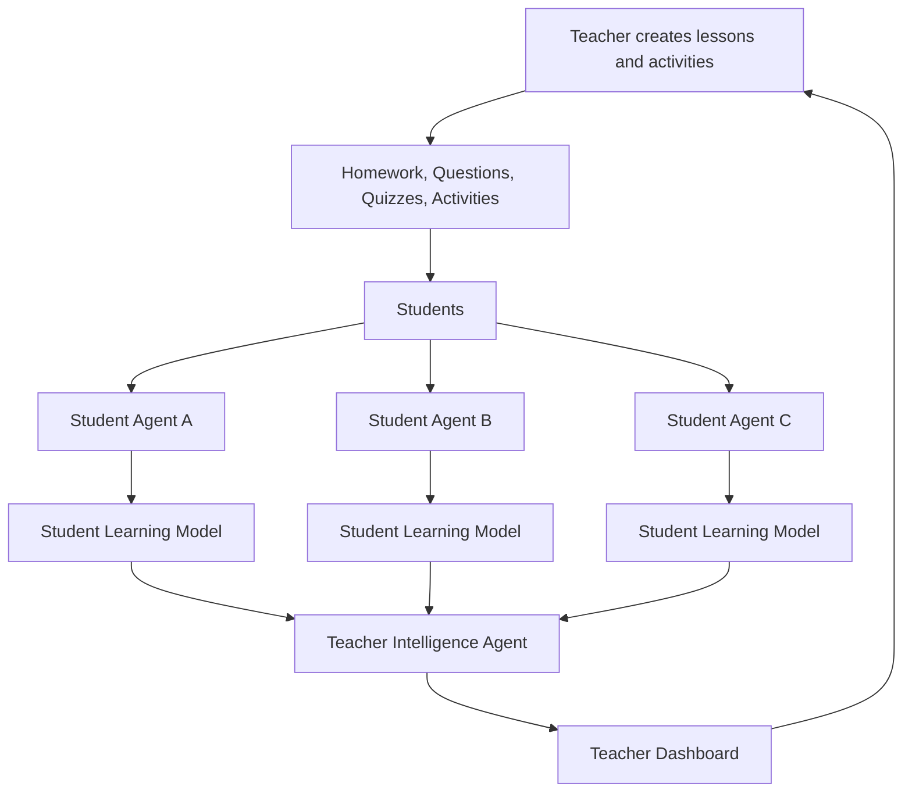

---
title: "Project: GenAI4ED"
---

# Research Link

:::{.callout-note}

How can generative AI agents support personalised active learning by adapting educational experiences to individual students while providing teachers with meaningful insights into student understanding?

:::

# The Research Problem

1. **What should the system represent about a learner?** Knowledge state, misconceptions, uncertainty, reasoning, engagement, progression.
2. **How does adaptation follow from that representation?** Whether the model genuinely drives the change, or generation does the work.
3. **How does the representation become a teacher-facing insight?** The underexplored part

***

# Implementation: Teacher-Governed AI Tutors

Real candidate school. Ages 14–15. One class, 25–30 students.

**Two agents:**

- **SA (Student Agent)**: one per student. Private tutor. Only that student can talk to it.
- **TA (Teacher Agent)**: works for the teacher. 
    - Turns her lesson plan into something the SAs can run
    - Watches all the SAs at once.

## How a Lesson Runs

- Teacher writes the lesson: 
    - objectives, materials, exercises, expected answers, help allowed

**Then**:

- Teacher approves it and switches it on.

**Then**:

- Students log in, each only sees their own SA.
- SA asks the student to attempt the question first.
- SA looks at the attempt, then gives only the next allowed level of help — never jumps straight to the answer.

**If**:

- Help ladder: attempt → hint → example → full answer (only if teacher allowed it).
- If a student struggles, asks for help, or something looks off, the system flags it.

**Teachers screen**:
- Teacher's screen stays quiet unless flagged she sees a simple list of who needs her.
- Teacher can jump in, message a student, pause the class, or explain something to everyone.

## Version 1 - How It Would Actually Be Built

- **Teacher console** - normal web form. Teacher types in the lesson, exercises, and answers. Saves to a database.
- **Student page**: simple chat screen. Student types, SA replies. One button: "get my teacher."
- **Tutor logic**: backend service. Takes the student's message, checks a database record for "what help level is this student allowed right now," asks the AI model for a reply, checks the reply follows the rule, sends it or asks the model again.
- **Records database**: one table logging every attempt, every hint given, every answer, timestamped. This is what the teacher's screen and any later analysis reads from.
- **Teacher's live view**: page that just queries that same database every few seconds and shows a short list: who's stuck, who asked for help, anything unusual.

No separate program per student — one shared service, separate rows in the database per student. Ordinary web app, not a swarm of independent agents talking to each other.

***

# Earlier Direction Sketches

::: {.callout-note collapse="true"}
## Old idea — Direction 1: Personalised Learning Assistant *(Constantine)*

Teacher provides a general lesson framework; the AI creates personalised versions based on each student's current understanding — alternative explanations, visualisations, examples, practice questions, additional exercises, targeted feedback.

**Limitation:** the student model was *instrumental* — it steers generation, nothing forces it to be inspectable.
:::

::: {.callout-note collapse="true"}
## Old idea — Direction 2: Student Learning Agents *(Diesel)*

Each student gets an agent that observes their interactions and builds an evolving model of their learning. A **Teacher Intelligence Agent** aggregates across student agents. The teacher decides interventions.

**Limitation:** a persistent monitoring agent per child sharpens every privacy problem, and aggregation was left unsolved.
:::

***

# Literature

| # | Paper | Key Finding | Status |
|---|---|---|---|
| P1 | *LLM Agents for Education*  | Educational agent work splits into **teaching assistance** and **student support** | Read |
| P2 | *SEM, Impact Factors on Student–AI Agent Interaction* | Interaction **willingness** dominates effectiveness far above any content or technology factor. | Read |
| P3 | *GenMentor: Goal-oriented Learning in an ITS* | A **persistent learner profile**, continuously updated, can drive personalised path and content generation through a multi-agent pipeline but nothing in it faces a teacher | Read |

**Where each one sits:** P2 is the paper that feels close to a actually implmentation: real classroom, builds teacher reports and never evaluates them.

 P3 is the paper it *builds from*: the mechanism for questions 1 and 2 already works there. P1 is the *map*.

::: {.callout-note collapse="true"}
## P1 in detail: LLM Agents for Education Chu et al. (2025)

A survey, not an empirical study.

**Taxonomy:**

| Family | Tasks |
|---|---|
| **Teaching Assistance Agents** | Classroom Simulation · Feedback Comment Generation · Curriculum Design |
| **Student Support Agents** | Adaptive Learning · Knowledge Tracing · Error Correction & Detection |

**Capability mapping**: Six capabilities across those six tasks. Personalisation is credited to nearly every task; explainability only two.

**Systems named**: CGMI (tree-based cognitive architecture, memory, reflection, planning across teacher/student/supervisor roles), Classroom Simulacra (iterative reflection for behaviour simulation), TeachTune and EduAgent (fine-grained behaviour prediction across student personas). All simulate synthetic students.

P1 credits multi-agent communication only to classroom simulation.

**Benchmarks listed**: MathDial, MathTutorBench, ErrorRadar, MathCCS, AAAR-1.0, heavily maths-oriented.

**Challenges**: Privacy, bias and fairness · hallucination and overreliance · integration with existing educational ecosystems, no standard deployment frameworks · multimodal agents.

:::

::: {.callout-note collapse="true"}
## P2 in detail: SEM, Impact Factors on Student–AI Agent Interaction Wang, Xie & Ke (2025)

Empirical SEM study.

**Setting.** "Generative classrooms" English reading and listening, grades 4–6, one primary school. Two-month experiment; 264 questionnaires distributed, **253 valid**.

**Their system.** Three subsystems: pre-class preparation (Learning Analysis Agent, Lesson Analysis Agent → diagnostic report, intelligent suite, resource packages)· in-class multi-agent interaction · after-class assessment (Data Analysis Agent for teachers, Academic Analysis Agent for students). Two dialogue agents built on Qwen and Doubao: an **Assistant Agent** (scaffolding for independent learning) and a **Peer Agent** (real-time equal interaction, expression skills).

**Constructs.** Eight latent variables, 24 observed, 5-point Likert: content usefulness (CU), content ease of use (CEU), perceived enjoyment (PE), teacher guidance (TG), interaction atmosphere (IA), technological facilitation (TF), interaction willingness (IW), interaction effectiveness (IE).

**Reading it critically** *(project reasoning)*: IE is measured as *perceived* effectiveness on a Likert scale: self-reported by grades 4–6 students. So P2 is strong evidence about what shapes willingness to engage, and weak evidence about what actually teaches anyone.

:::

::: {.callout-note collapse="true"}
## P3 in detail: GenMentor Wang et al. (2025)

Multi-agent intelligent tutoring framework.

**Setting**: Goal-oriented learning for **adult professional learners** pursuing self-set goals, not a classroom, no children, no teacher anywhere in the system.

**Their architecture.** Four agents:

| Agent | Role |
|---|---|
| **Skill Gap Identification** | Maps a learning goal to required skills, then to the learner's gaps. Fine-tuned LLM on a purpose-built goal-to-skill dataset with chain-of-thought prompting |
| **Adaptive Learner Modeling** | Maintains a **Comprehensive Learner Profile**: knowledge status, preferences, behavioural patterns — updated continuously from real-time interaction |
| **Path Scheduler** | Evolvable learning-path scheduling, with an embedded *learner simulator* used to anticipate how the learner will respond |
| **Content Creator** | Generates tailored material via an exploration → drafting → integration mechanism |

This is the existing proof that a **persistent learner model can genuinely drive adaptation** rather than sit decoratively beside a generator.

:::

***

# References

**P1** — Chu, Z., Wang, S., Xie, J., Zhu, T., Yan, Y., Ye, J., Zhong, A., Hu, X., Liang, J., Yu, P. S., & Wen, Q. (2025). *LLM Agents for Education: Advances and Applications*. Findings of the ACL: EMNLP 2025, 13782–13810. [arXiv:2503.11733](https://arxiv.org/abs/2503.11733) · [ACL Anthology](https://aclanthology.org/2025.findings-emnlp.743/)

**P2** — Wang, L., Xie, Y., & Ke, J. (2025). *Using Structural Equation Modeling to Analyze Impact Factors on Students and AI Agents Interaction Effectiveness in Elementary English Classes*. 2025 International Symposium on Educational Technology (ISET), 330–334. School of Educational Information Technology, South China Normal University. DOI [10.1109/ISET65607.2025.00071](https://doi.org/10.1109/ISET65607.2025.00071) · [IEEE Xplore 11113575](https://ieeexplore.ieee.org/document/11113575/)

**P3** — Wang, T., Zhan, Y., Lian, J., Hu, Z., Yuan, N. J., Zhang, Q., Xie, X., & Xiong, H. (2025). *LLM-powered Multi-agent Framework for Goal-oriented Learning in Intelligent Tutoring System*. Companion Proceedings of the ACM Web Conference 2025. DOI [10.1145/3701716.3715244](https://doi.org/10.1145/3701716.3715244) · [arXiv:2501.15749](https://arxiv.org/abs/2501.15749)
