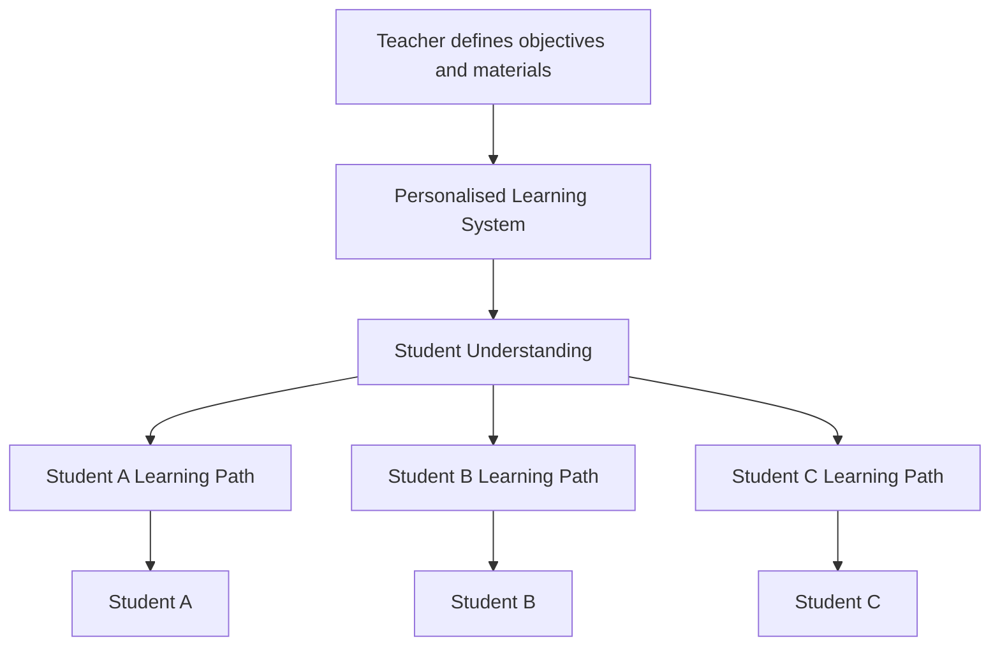
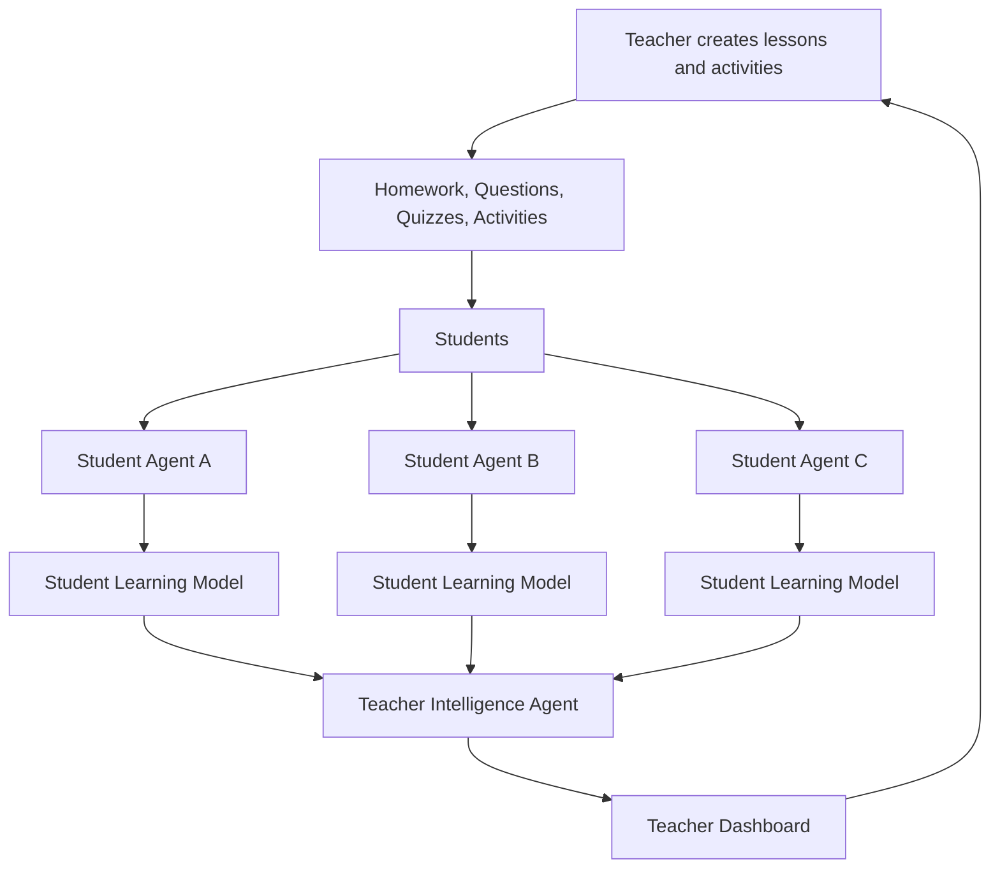

---
title: "Project: GenAI4ED"
---

# Research Link

How can generative AI agents support personalised active learning by adapting educational experiences to individual students while providing teachers with meaningful insights into student understanding?

***

# Core Idea

The goal is to explore how AI agents can enhance active learning environments.

Rather than replacing teachers or automatically generating complete lessons, AI systems can act as adaptive layers that understand student interactions and provide personalised support.

Two possible implementation directions are being considered:

1. **Personalised Learning Assistant** (Constantine Idea)
2. **Student Learning Agents**         (Diesel Idea)

Both approaches use generative AI, but they differ in the role and autonomy of the AI system.

***

# Direction 1: Personalised Learning Assistant

The teacher provides a general lesson framework.

The AI creates personalised versions of the learning experience based on each student's current understanding.

The AI can generate:

- alternative explanations
- visualisations
- examples
- practice questions
- additional exercises
- targeted feedback

***

# System Architecture

***

# Direction 2: Student Learning Agents

This direction explores AI agents that act as personalised learning observers.

Each student is assigned an AI agent that monitors learning interactions and develops an evolving representation of the student's learning process.

> What does this student understand, where are they struggling, and what learning patterns are emerging?

The student agent maintains information about:

- knowledge state
- misconceptions
- uncertainty
- reasoning patterns
- engagement
- learning progression

***

# System Architecture

***
## Student Agent Role

Each student agent builds an evolving model of the student's learning process by analysing interactions such as:

- answers and mistakes
- homework and activity completion
- engagement patterns
- reasoning and explanations
- confidence and uncertainty

The goal is not to diagnose students, but to identify learning patterns, misconceptions, and areas where additional support may be needed.

***

## Teacher Intelligence Agent

A teacher-level agent aggregates information from student agents and provides higher-level insights.

Instead of manually reviewing individual interactions, the teacher receives summaries of:

- common misconceptions
- students requiring additional support
- engagement changes
- learning progress

The teacher remains responsible for deciding interventions.

***

## Potential Applications

- Early identification of learning difficulties
- Personalised support recommendations
- Classroom-level learning insights
- Evaluation of learning activities
