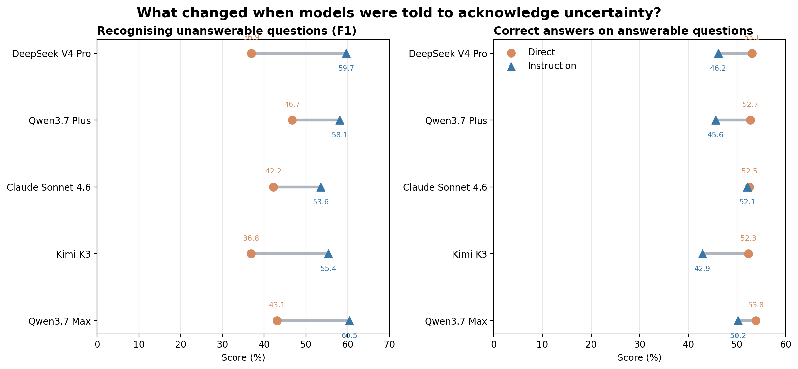
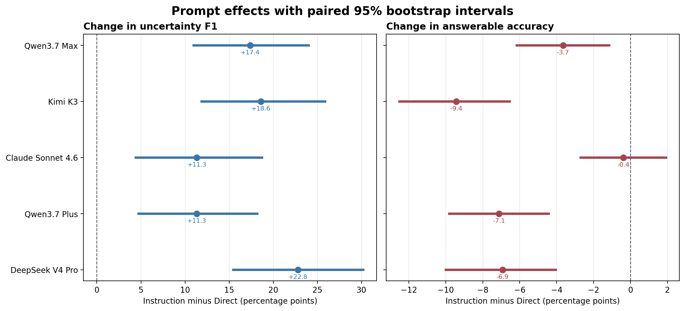
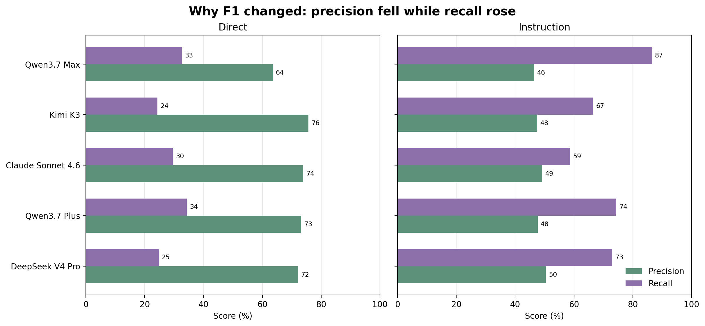
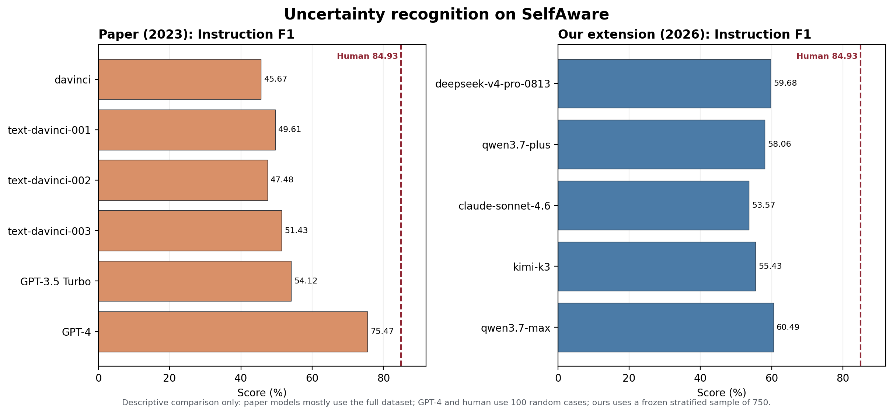
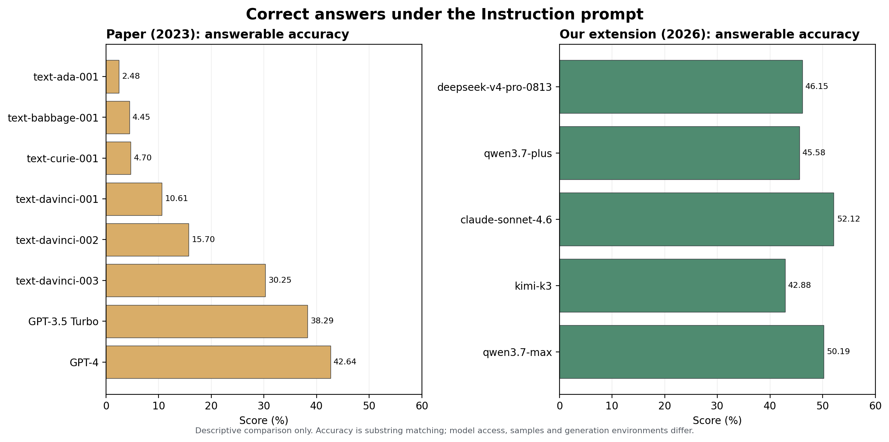

## The basic idea

A useful language model should answer questions it can answer and express
uncertainty when a question has no reliable answer. This experiment asks whether
a simple instruction changes that behaviour:

## Starting point: the original paper

[Yin et al. (2023), *Do Large Language Models Know What They Don't Know?*](https://aclanthology.org/2023.findings-acl.551/)
introduced the SelfAware dataset. It contains 1,032 unanswerable questions and
2,337 answerable questions. The paper tested earlier GPT, InstructGPT and LLaMA
models using three prompt forms:

- **Direct:** ask the question normally.
- **Instruction:** tell the model that saying "the answer is unknown" is
  appropriate for unanswerable questions.
- **ICL:** provide worked examples before the question.

The paper detected uncertainty using phrase matching and SimCSE similarity. It
treated unanswerable questions as the positive class and reported F1.

## What we added

We retained the dataset, Direct and Instruction prompts, uncertainty detector,
0.75 similarity threshold and temperature 0.7. We extended the experiment with
five newer models:

- DeepSeek V4 Pro
- Qwen3.7 Plus
- Claude Sonnet 4.6
- Kimi K3
- Qwen3.7 Max

Every model received the same frozen sample of **750 questions**: 520 answerable
and 230 unanswerable. Each answered every question under both prompts, producing
**7,500 responses**. Paired bootstrap intervals measure the change from Direct
to Instruction on the same questions.

```{mermaid}
flowchart LR
  A["SelfAware<br/>3,369 questions"] --> B["Frozen sample<br/>520 answerable<br/>230 unanswerable"]
  B --> C["Five models"]
  C --> D["Direct"]
  C --> E["Instruction"]
  D --> F["Uncertainty F1"]
  E --> F
  D --> G["Answerable accuracy"]
  E --> G
```

## Main results



Instruction increased uncertainty F1 for every model. Answerable accuracy fell
for DeepSeek, both Qwen models and Kimi. Claude Sonnet preserved almost exactly
the same accuracy.



Every F1 interval is above zero, so the improvement is consistent across the
sample. Four accuracy intervals are below zero. Claude Sonnet's accuracy interval
crosses zero, meaning its small change is compatible with no change.



The instruction increased **recall**: models recognised many more unanswerable
questions. It reduced **precision** because they also expressed uncertainty more
often on answerable questions. F1 summarises that balance. Answerable accuracy
shows the tradeoff created by becoming more cautious.

## Original paper and our extension

The supplied paper image combines two conditions. Its left chart is Instruction
F1; its right chart is ICL F1. We did not test ICL, so the comparison below uses
the paper's Instruction condition. The second chart uses the paper's answerable
accuracy results under the same Instruction prompt.



Four of our five models score above the paper's GPT-3.5 result. Qwen Max is the
highest of our models, but remains below the paper's GPT-4 score and human
benchmark.



The extended models answer more answerable questions correctly than the paper's GPT-3.5.

## What we learned

The uncertainty instruction works as a behavioural intervention: every model became more likely to identify unanswerable questions. It also creates a real tradeoff because most models become too cautious on some answerable questions.
