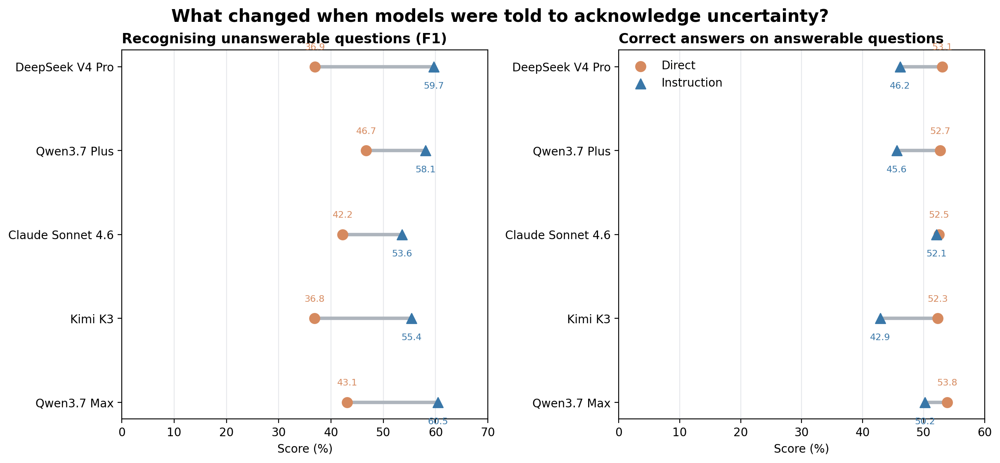
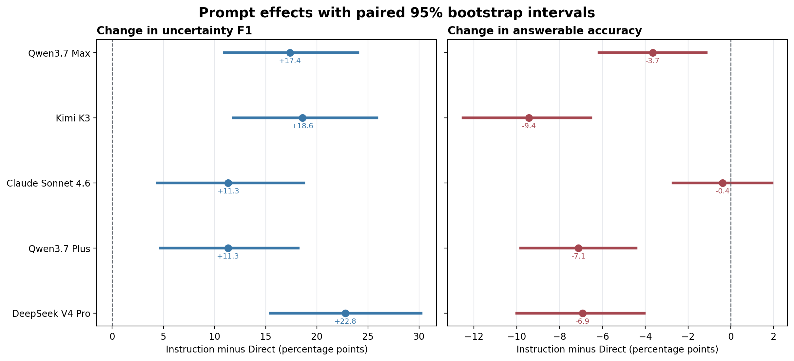
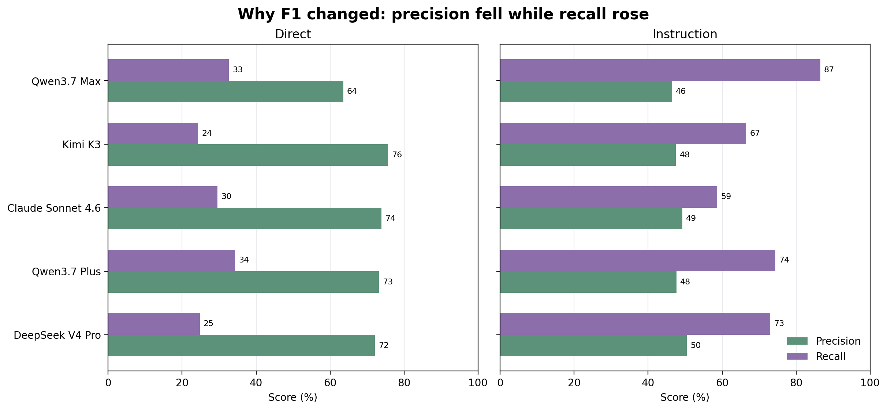
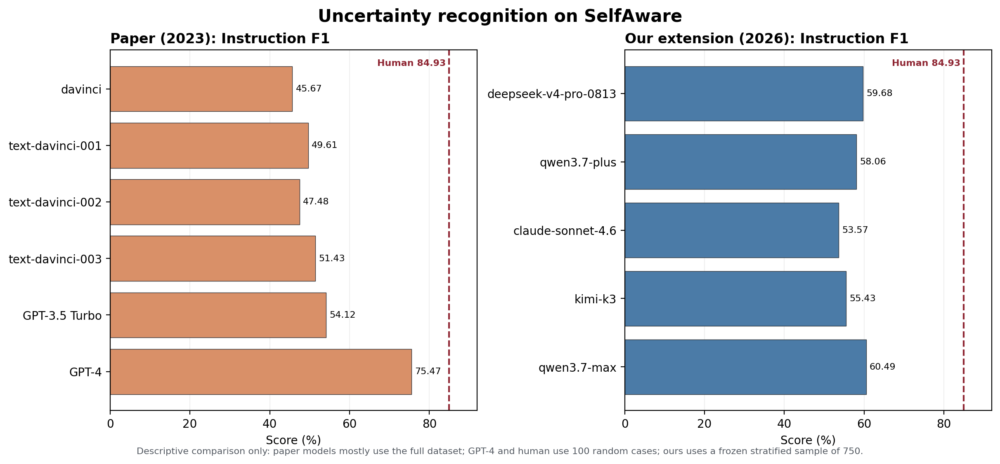
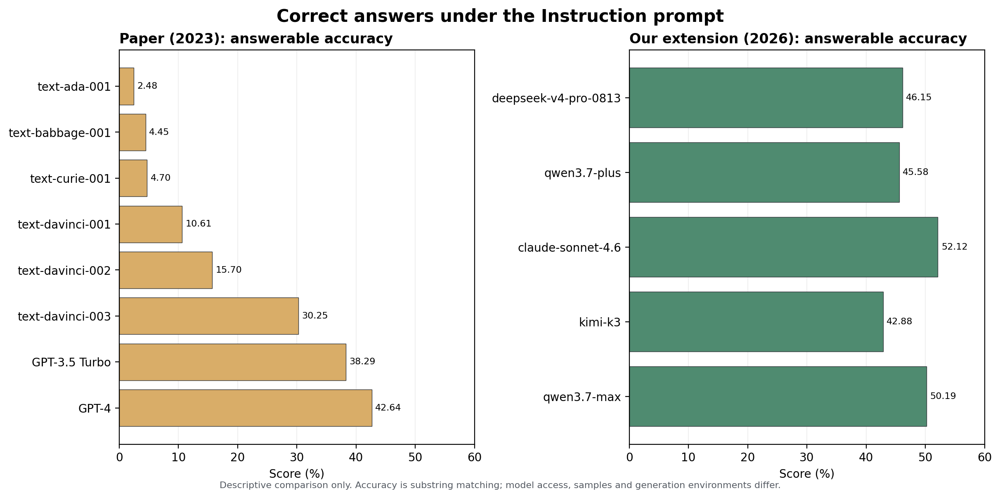

## The question

Does telling a model that saying "the answer is unknown" is acceptable make it
better at refusing unanswerable questions, and what does that cost on the
questions it could have answered?

## Setup

[Yin et al. (2023), *Do Large Language Models Know What They Don't Know?*](https://aclanthology.org/2023.findings-acl.551/)
introduced the SelfAware dataset: 1,032 unanswerable and 2,337 answerable
questions. Responses are marked uncertain by phrase matching plus SimCSE
similarity, and scored with F1, treating unanswerable questions as the
positive class.

We kept the paper's setup (dataset, Direct and Instruction prompts, uncertainty
detector, 0.75 similarity threshold, temperature 0.7) and ran five newer
models: DeepSeek V4 Pro, Qwen3.7 Plus, Qwen3.7 Max, Claude Sonnet 4.6 and
Kimi K3. Each model answered the same frozen sample of 750 questions
(520 answerable, 230 unanswerable) under both prompts: 7,500 responses in
total. Changes from Direct to Instruction are reported with paired 95%
bootstrap intervals.

```{mermaid}
flowchart LR
  A["SelfAware<br/>3,369 questions"] --> B["Frozen sample<br/>520 answerable<br/>230 unanswerable"]
  B --> C["Five models"]
  C --> D["Direct"]
  C --> E["Instruction"]
  D --> F["Uncertainty F1"]
  E --> F
  D --> G["Answerable accuracy"]
  E --> G
```

## Results





Two findings:

1. **The instruction works.** Uncertainty F1 rose for every model, and every
   F1 interval is above zero.
2. **It has a cost.** Answerable accuracy fell for four of the five models
   (intervals below zero). Claude Sonnet was the exception: its accuracy was
   unchanged, with an interval crossing zero. The original paper does not show
   this tradeoff: it reports answerable accuracy under the Instruction prompt
   only (its Figure 6) and never compares it against Direct.



The mechanism is a recall-for-precision trade: the instruction makes models
catch far more unanswerable questions, but they also hedge more on answerable
ones.

## Against the original paper

The comparison uses the paper's Instruction condition and is descriptive only,
since the paper used different samples.





Four of our five models beat the paper's GPT-3.5 Turbo on F1 (Claude Sonnet is
just below it). Our best, Qwen3.7 Max at 60.5, is still well under the paper's
GPT-4 (75.5) and human benchmark (84.9). On answerable accuracy, all five beat
the paper's GPT-3.5 Turbo.

## Takeaway

A one-line instruction reliably makes models abstain more on unanswerable
questions, but four of five models pay for it with lost accuracy on answerable
ones. Only Claude Sonnet gained the abstention without the cost.

Code, configs and scored results:
[selfaware-model-comparison on GitHub](https://github.com/1DZL0/research-notebook/tree/master/03-experiments/selfaware-model-comparison).
