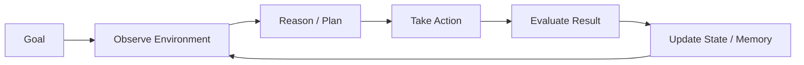
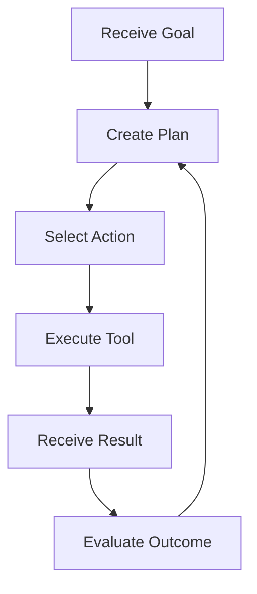

## Overview

An AI agent is a system that uses a large language model (LLM) as a reasoning component combined with tools, memory, and feedback mechanisms to achieve goals autonomously.

Unlike a traditional LLM application:

```
Input → Model → Output
```

An agent operates through an iterative loop where it can observe, reason, act, and update its state.



The key difference is that an agent can decide actions, use tools, maintain state, and adapt based on feedback.

---

### Core Components of an Agent

| Component | Purpose |
|---|---|
| LLM | Reasoning and decision making |
| Tools | Interaction with external systems |
| Memory | Store and retrieve information |
| State | Track task progress |
| Evaluation | Measure and improve performance |

---

### Agent Loop




